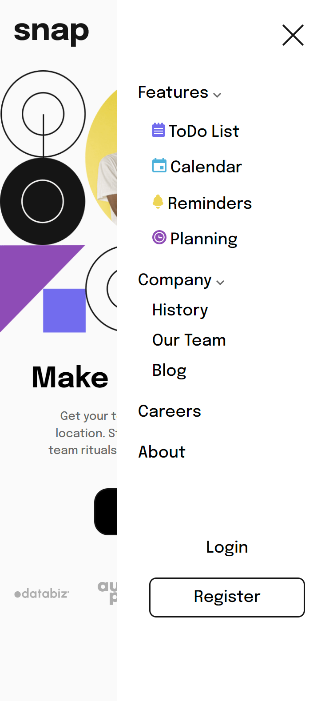

# Intro section with dropdown navigation

### This is a solution to the [Intro section with dropdown navigation challenge on Frontend Mentor](https://www.frontendmentor.io/challenges/intro-section-with-dropdown-navigation-ryaPetHE5)

### I have created this project with the purpose of enhancing my website designing skills!

### Built with:
#### - HTML
#### - Scss
#### - JavaScript

## Screenshots

### Desktop

    

    

### Mobile Phone

    

    

